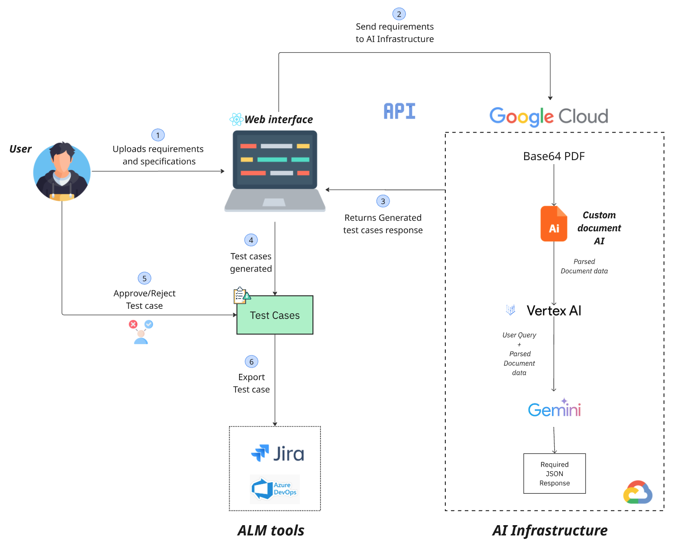
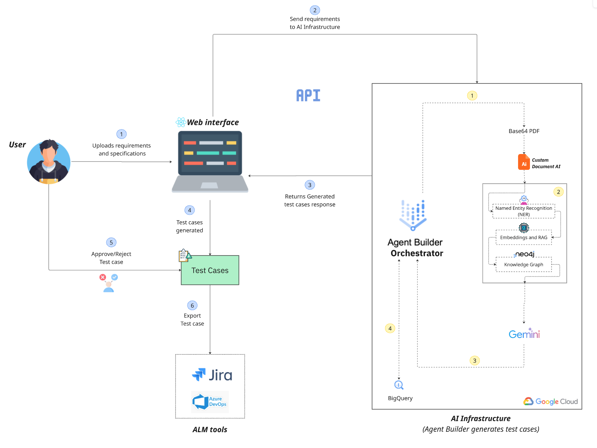
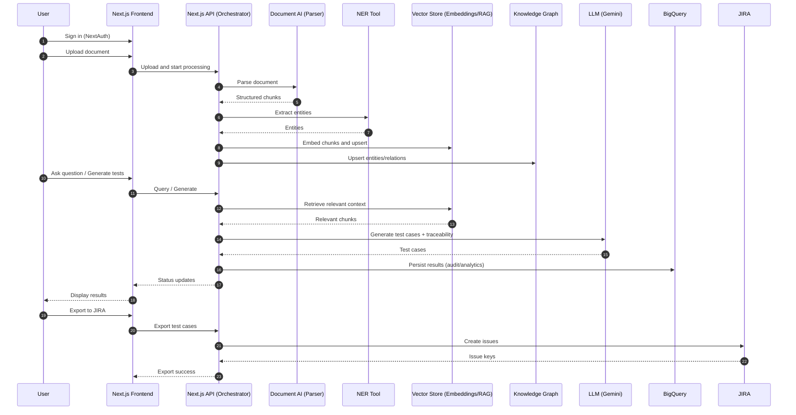

# TestAI — AI Powered Test Case Generator

**Hackathon Submission** for the Gen AI Exchange Hackathon by [Hack-2-Skills](https://vision.hack2skill.com/event/genaiexchangehackathon) \
 [Live demo](https://test-ai-gcp.vercel.app/) | [Video demo](https://youtu.be/NofZPOIaCEw)
 
## Problem Statement
#### Automating Test Case Generation with AI (Professional Track):
Develop an AI-powered system that automatically converts healthcare software requirements into compliant, traceable test cases integrated with enterprise toolchains.

## Tech Stack

- Next.js 15
- NextAuth (Google provider)
- Google Cloud Document AI
- Gemini / Vertex AI (via REST + google-auth)
- Sass for UI development

## Current available Features

- **Google Authentication** - Secure login using NextAuth.js
- **Document Processing** - Extract text from only PDF files using Google Document AI
- **AI Test Generation** - Generate comprehensive test cases using Google Gemini AI
- **Jira Integration (ALM tool)** - Export test cases directly to Jira projects with issue type selection
- **Streamlined Workflow** - Simple 3-step process from document to test cases

## Current Architecture



## Features to be implemented

- **Named Entity Recognition (NER)** - Detect key entities like user roles, actions, and regulatory standards.
- **Embeddings + RAG** - Capture deeper context and relationships within documents.
- **Knowledge Graph** - Represent entities and relationships in a Neo4j knowledge graph for querying, traceability, and compliance.
- **Vertex AI Agent Builder** - Orchestrates the full pipeline from ingestion and parsing to test case generation and storage.
- **Gemini Integration** - Uses the knowledge graph and context to generate accurate, regulation-aware test cases.
- **BigQuery Integration** - Enables auditing of test cases.

## Expected Architecture




## Project Structure

```
src/
  app/
    login/                 # Sign-in page
    a/                     # Authenticated area
      chat/                # Chat interface
        [id]/              # Dynamic chat pages
        components/        # Chat UI components
          TestCaseWorkflow/ # Test case generation workflow
            SelectTestCategory/    # Category selection
            ReviewTestCases/       # Test case review
            ExportTestCases/       # Export workflow
              SelectExportToolStep/    # Tool selection
              ConnectJiraStep/         # Jira connection
              SelectJiraProjectStep/    # Project & issue type selection
              ExportTestCasesStep/      # Export execution
              ExportSuccessStep/       # Success confirmation
        context/           # Chat state management
        styles/            # Chat-specific styles
      connect/jira/        # Jira connection page
    api/
      auth/[...nextauth]/  # NextAuth handler
      document-ai/         # Document AI processing
      gemini/generate-test-cases/  # AI test case generation
      jira/                # Jira integration APIs
        issue/             # Issue management
        callback/          # OAuth callback
        connect-jira/      # Jira connection
        get-projects/      # Project listing
        get-access-token/  # Token management
      proxy-image/         # Image proxy for avatars
    middleware.ts          # Route protection
  components/              # Shared components
    ReactToastify/         # Toast notifications
    Modal.tsx              # Modal component
    Provider.tsx           # App providers
    SignIn.tsx             # Sign-in component
  assets/                  # Static assets (logos)
  utils/                   # Utility functions
    documentAIClient.ts    # Document AI client
    geminiAuth.ts          # Gemini authentication
    generateUniqueId.ts    # ID generation
```

## Data flow diagram



## Prerequisites

- **Node.js 18+**
- **Google Cloud Project** with:
  - Document AI API enabled and a Processor created
  - Vertex AI API enabled
  - Service Account with Document AI and Vertex AI roles
  - Google Cloud credentials (JSON key file or environment variables)
- **Google OAuth** credentials for NextAuth authentication
- **Jira Cloud** account with:
  - OAuth 2.0 app created in Atlassian Developer Console
  - Client ID and Secret for Jira integration
  - Redirect URI configured for OAuth flow
- **Environment Variables**:
  - `GOOGLE_CLIENT_ID` & `GOOGLE_CLIENT_SECRET` (OAuth)
  - `GOOGLE_APPLICATION_CREDENTIALS` or `GOOGLE_APPLICATION_CREDENTIALS_JSON`
  - `GOOGLE_CLOUD_PROJECT_ID` & `GOOGLE_CLOUD_LOCATION`
  - `GEMINI_MODEL` (e.g., "gemini-1.5-pro")
  - `JIRA_CLIENT_ID`, `JIRA_CLIENT_SECRET`, `JIRA_REDIRECT_URI`
  - `JIRA_CLIENT_URL` (Atlassian Cloud URL)
  - `NEXTAUTH_SECRET` (NextAuth session secret)

## Environment Variables

Use the following values:

```bash
# NextAuth
NEXTAUTH_SECRET=your_random_secret
GOOGLE_CLIENT_ID=your_google_oauth_client_id
GOOGLE_CLIENT_SECRET=your_google_oauth_client_secret

# Google Cloud auth
# Use ONE of the following three for Google credentials
# 1) Local file path (best for local dev)
GOOGLE_APPLICATION_CREDENTIALS=/absolute/path/to/key.json
# 2) Raw JSON (paste the full service account JSON)
# GOOGLE_APPLICATION_CREDENTIALS_JSON={"type":"service_account",...}
# 3) Base64-encoded JSON (useful for CI)
# GOOGLE_APPLICATION_CREDENTIALS_BASE64=eyJ0eXBlIjoic2VydmljZV9hY2NvdW50Ii4uLg==
GOOGLE_CLOUD_PROJECT_ID=your_gcp_project_id

# Document AI
DOCUMENT_AI_PROJECT_ID=your_gcp_project_id
DOCUMENT_AI_LOCATION=us
DOCUMENT_AI_PROCESSOR_ID=your_processor_id

# Gemini / Vertex AI
GOOGLE_CLOUD_LOCATION=us-central1
GEMINI_MODEL=gemini-1.5-pro

# Jira Integration
JIRA_CLIENT_ID=your_jira_oauth_client_id
JIRA_CLIENT_SECRET=your_jira_oauth_client_secret
JIRA_REDIRECT_URI=http://localhost:3000/api/jira/callback
JIRA_CLIENT_URL=https://your-domain.atlassian.net

# Development
NEXT_PUBLIC_LIVE=false
```

Notes:
- Provide credentials via ONE of `GOOGLE_APPLICATION_CREDENTIALS`, `GOOGLE_APPLICATION_CREDENTIALS_JSON`, or `GOOGLE_APPLICATION_CREDENTIALS_BASE64`.
- If using a file path, it must be absolute (e.g., `/var/task/key.json`).
- For `GEMINI_MODEL`, any available Vertex model name is supported.

## Setup

```bash
# Install deps
yarn install

# Dev server
yarn dev

# Build & start
yarn build
yarn start
```

Open `http://localhost:3000`.

## License

Proprietary – for hackathon use only.
