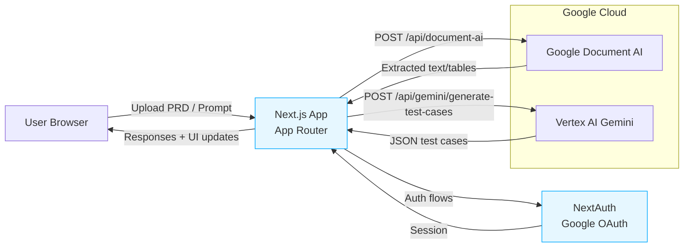
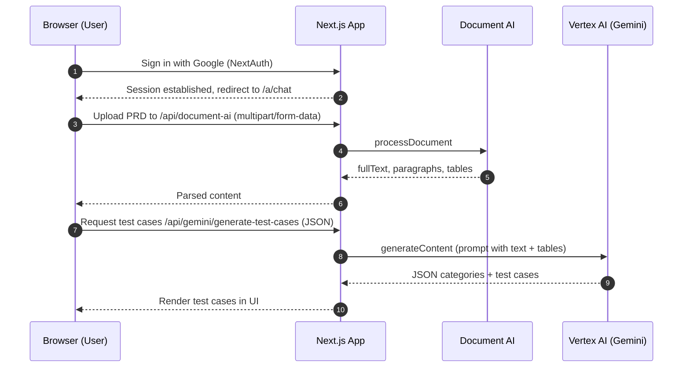

# Knull — AI Test Case Generator for PRDs (Next.js 15) 🧪🤖

Knull is a Next.js application that converts PRD documents into structured, categorized test cases using Google Cloud Document AI for parsing and Gemini/Vertex AI for generation. It includes Google authentication, a chat-style UI, and resilient serverless APIs.

## ✨ Features

- 🔐 **Google Sign-In (NextAuth)**: Secure login with Google OAuth; middleware guards routes.
- 📄 **Document parsing (Document AI)**: Extracts full text, paragraphs, and table contents from uploaded docs.
- 🧠 **AI test case generation (Gemini / Vertex AI)**: Produces structured JSON of categories and test cases.
- 💬 **Chat workflow UI**: Smooth chat layout with prompts, responses, and test case workflow components.
- 🧱 **Robust server routes**: Typed Next.js Route Handlers with error handling and input validation.
- 🎨 **Sass styling**: Modular SCSS for pages and components.

## 🧰 Tech Stack

- Next.js 15 (App Router, server components)
- React 19
- NextAuth (Google provider)
- Google Cloud Document AI
- Gemini / Vertex AI (via REST + google-auth)
- TypeScript, Sass, React Toastify

## 📁 Project Structure

```
src/
  app/
    login/                 # Sign-in page
    a/                     # Authenticated area
      chat/                # Chat + workflow
        components/        # Chat UI + workflow components
        context/           # Chat context
        styles/            # Chat styles
    api/
      auth/[...nextauth]/  # NextAuth handler
      document-ai/         # Document AI processing route (POST)
      gemini/generate-test-cases/  # Test case generation route (POST)
    middleware.ts          # Route protection and redirects
  components/              # Shared components (Provider, Modal, Toast)
  utils/                   # GCP clients and helpers
```

## 🏛️ Architecture



## ✅ Prerequisites

- Node.js 18+
- A Google Cloud project with:
  - Document AI enabled and a Processor created
  - Vertex AI API enabled
  - A Service Account with roles for Document AI and Vertex AI
- Google OAuth credentials (Client ID/Secret) for NextAuth

## 🔧 Environment Variables

Copy `.env.example` to `.env.local` at the project root and fill values:

```bash
# NextAuth
NEXTAUTH_SECRET=your_random_secret
GOOGLE_CLIENT_ID=your_google_oauth_client_id
GOOGLE_CLIENT_SECRET=your_google_oauth_client_secret

# Google Cloud auth
# Use ONE of the following three for Google credentials
# 1) Local file path (best for local dev)
GOOGLE_APPLICATION_CREDENTIALS=/absolute/path/to/key.json
# 2) Raw JSON (paste the full service account JSON)
# GOOGLE_APPLICATION_CREDENTIALS_JSON={"type":"service_account",...}
# 3) Base64-encoded JSON (useful for CI)
# GOOGLE_APPLICATION_CREDENTIALS_BASE64=eyJ0eXBlIjoic2VydmljZV9hY2NvdW50Ii4uLg==
GOOGLE_CLOUD_PROJECT_ID=your_gcp_project_id

# Document AI
DOCUMENT_AI_PROJECT_ID=your_gcp_project_id
DOCUMENT_AI_LOCATION=us
DOCUMENT_AI_PROCESSOR_ID=your_processor_id

# Gemini / Vertex AI
GOOGLE_CLOUD_LOCATION=us-central1
GEMINI_MODEL=gemini-1.5-pro

# Jira Integration
JIRA_CLIENT_ID=your_jira_oauth_client_id
JIRA_CLIENT_SECRET=your_jira_oauth_client_secret
JIRA_REDIRECT_URI=http://localhost:3000/api/jira/callback
JIRA_CLIENT_URL=https://your-domain.atlassian.net

# Development
NEXT_PUBLIC_LIVE=false
```

Notes:
- Provide credentials via ONE of `GOOGLE_APPLICATION_CREDENTIALS`, `GOOGLE_APPLICATION_CREDENTIALS_JSON`, or `GOOGLE_APPLICATION_CREDENTIALS_BASE64`.
- If using a file path, it must be absolute (e.g., `/var/task/key.json`).
- For `GEMINI_MODEL`, any available Vertex model name is supported.

## 🚀 Setup

```bash
# Install deps
yarn install

# Dev server
yarn dev

# Build & start
yarn build
yarn start
```

Open `http://localhost:3000`.

## 🔄 High-level Flow



## 🔐 Authentication Flow

- Public page: `/login`
- Middleware (`src/middleware.ts`) allows `/login` and requires auth for others.
- After sign-in, users are redirected to `/a/chat`.
- If an authenticated user hits non-`/a` routes, they’re redirected to `/a`.

## 🛰️ API Endpoints

### POST /api/document-ai
Processes an uploaded file with Document AI and returns extracted content.

- Content-Type: `multipart/form-data`
- Field: `file` (File)

Response shape:
```json
{
  "success": true,
  "data": {
    "fullText": "...",
    "paragraphs": ["..."],
    "tables": ["Header1 | Header2\nRow1Col1 | Row1Col2"],
    "fileName": "document.pdf",
    "fileSize": 12345
  }
}
```

Errors return `{ error, details }` with proper status codes.

### POST /api/gemini/generate-test-cases
Generates structured test cases from PRD text using Vertex AI.

- Content-Type: `application/json`
- Body:
```json
{
  "documentText": "<string>",
  "tables": ["<string>"] ,
  "userQuery": "<optional string>",
  "fileName": "<optional string>"
}
```

Response shape:
```json
{
  "success": true,
  "data": {
    "documentSummary": "...",
    "categories": [
      {
        "id": "functional",
        "label": "Functional Testing",
        "description": "...",
        "testCases": [
          { "id": "tc_1", "title": "...", "content": "...", "priority": "High" }
        ]
      }
    ]
  },
  "metadata": {
    "fileName": "...",
    "userQuery": "...",
    "documentSummary": "...",
    "generatedAt": "ISO-8601",
    "totalCategories": 4,
    "totalTestCases": 10,
    "usingVertexAI": true
  }
}
```

Errors return `{ error, details }` with proper status codes.

## 💡 Local Development Tips

- 💾 For local dev, place your service account JSON at the repo root as `key.json` and set `GOOGLE_APPLICATION_CREDENTIALS` to its absolute path.
- Ensure the service account has the right roles for both Document AI and Vertex AI.
- For large PRDs, the server truncates text to a reasonable size before sending to Gemini.
- Toast notifications are configured via `ReactToastify` in `src/app/layout.tsx`.

## ☁️ Deploying on Vercel

Set the following Environment Variables in Vercel Project Settings → Environment Variables:

- `NEXTAUTH_SECRET`
- `GOOGLE_CLIENT_ID`
- `GOOGLE_CLIENT_SECRET`
- `GOOGLE_CLOUD_PROJECT_ID`
- `DOCUMENT_AI_PROJECT_ID`
- `DOCUMENT_AI_LOCATION` (e.g., `us`)
- `DOCUMENT_AI_PROCESSOR_ID`
- `GOOGLE_CLOUD_LOCATION` (e.g., `us-central1`)
- `GEMINI_MODEL` (e.g., `gemini-1.5-pro`)
- `JIRA_CLIENT_ID`
- `JIRA_CLIENT_SECRET`
- `JIRA_REDIRECT_URI` (e.g., `https://your-app.vercel.app/api/jira/callback`)
- `JIRA_CLIENT_URL` (e.g., `https://your-domain.atlassian.net`)
- `NEXT_PUBLIC_LIVE` (set to `true` for production)

Provide Google credentials using ONE of:

- `GOOGLE_APPLICATION_CREDENTIALS_JSON` with the full JSON content pasted as the value, or
- `GOOGLE_APPLICATION_CREDENTIALS_BASE64` with a base64 of the JSON content.

You do not need to upload `key.json` to Vercel. The code automatically picks the JSON/base64 vars in production.

## 📜 Scripts

```bash
yarn dev       # Start dev server (Turbopack)
yarn build     # Build (Turbopack)
yarn start     # Start production server
yarn lint      # Run ESLint
```

## 📄 License

Proprietary – for hackathon/demo use. Update as needed.
